# Digital Ocean -- Uploading a PHP Website

In this repo I will document how to upload a local PHP website with a local MySQL database to [DigitalOcean](https://www.digitalocean.com/).  Below is a list of tutorials that I found helpful while learning how to use DigitalOcean and website hosting associated concepts.

### Deployment Guides     
|   Source   | Link  |
| ---------- | ----- |
| Traversy Media | [YouTube](https://www.youtube.com/watch?v=BUasdmczmMw) |
| Codecourse | [YouTube](https://www.youtube.com/playlist?list=PLfdtiltiRHWFuRwcp93nixCyT7zhHWUi1) |

### Concepts   
|   Concept   | Link  |
| ---------- | ----- |
| Cloud Computing | [Professor Messer](https://www.youtube.com/watch?v=rj3dxXLys0M) |
| Explanation of a VPS | [Pickaweb.co.uk](https://www.youtube.com/watch?v=q0vLuO2vyN4) | 
| Beginners Guide to SSH | [Tech Guy DIY](https://www.youtube.com/watch?v=hHs98hLtZJo) | 
| How SSH Works | [Karol Cholewa](https://www.youtube.com/watch?v=zlv9dI-9g1U) | 
| Asymmetric Encryption | [Savjee](https://www.youtube.com/watch?v=AQDCe585Lnc) | 
| Overview of IPv4 and IPv6 | [Professor Messer](https://www.youtube.com/watch?v=k6nrH8JiTTU) | 
| Overview of File Transfer Protocols | [Professor Messer](https://www.youtube.com/watch?v=fpF3X_hdscc) | 

---

**Table of Contents**       
[What is DigitalOcean?](#what-is-digitalocean)      
[Getting Started: Configure Your Droplet](#getting-started-configure-your-droplet)      
[Getting Started: Add Your SSH Keys](#getting-started-add-your-ssh-keys)      
[Getting Started: Create Your Droplet](#getting-started-create-your-droplet)     
[Connect To Your VPS](#connect-to-your-vps)      
[Connect via SFTP and WinSCP](#connect-via-sftp-and-winscp)      
[Change Default File Location](#change-default-file-location)      
[Uploading the PHP Site](#uploading-the-php-site)      
[Setup MySQL](#setup-mysql)      
[Connect to MySQL using an SSH Client](#connect-to-mysql-using-an-ssh-client)      
[Export local MySQL Database and Import to Your VPS](#export-local-mysql-database-to-your-vps)      
[Configure Your PHP Database File](#configure-your-php-database-file)      
[Deployment Conclusion](#deployment-conclusion)      


## What is DigitalOcean

DigitalOcean is a cloud computing platform for hosting websites through a Virtual Private Server (VPS).  In cloud computing terms, DigitalOcean is a Infrastructure as a Service (IaaS), not to be confused with a Platform as a Service (PaaS) ([Is DigitalOcean a IaaS or PaaS](https://www.digitalocean.com/community/questions/is-digitalocean-iaas-or-paas-platform)).

DigitalOcean offers its clients a configurable Droplet, which is the VPS.  These Droplets contain the Operating System, databases, and anything else a website needs to be deployed live.  Think of these Virtual Servers as full-fledged physical servers at a fraction of the cost.

## Getting Started: Configure Your Droplet

After signing up for a DigitalOcean account, you'll be presented a Droplet screen like the one below:

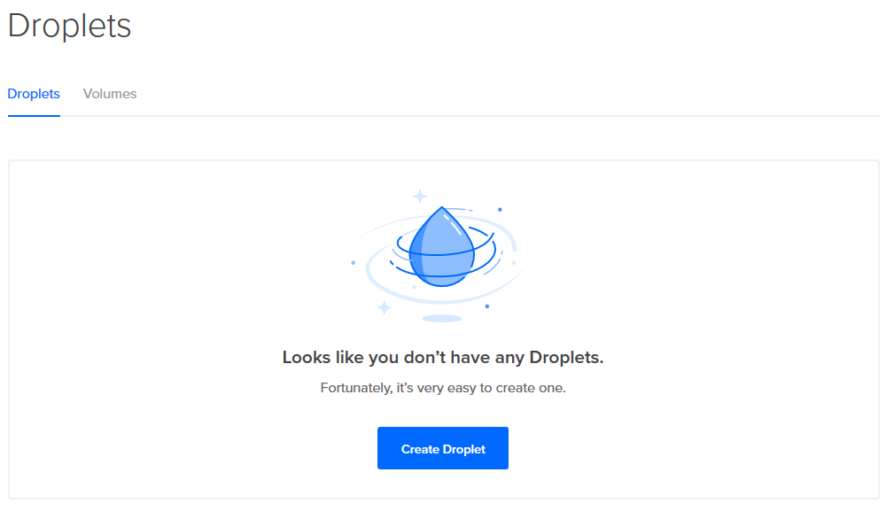

Click create a droplet then do the following:

1.  Where is says Choose an image, click **One-click apps**

2.  This repo covers how to deploy a PHP site, so choose the **LAMP on 16.04** option.  This will automatically install the LAMP stack (Linux, Apache, MySQL and PHP) onto your Droplet/VPS.

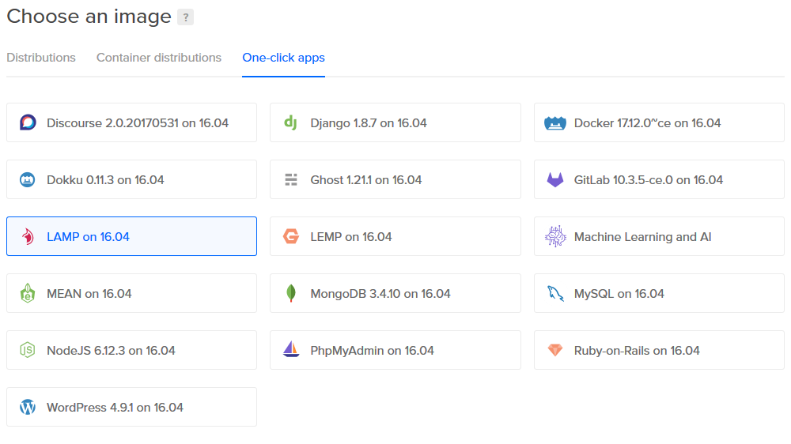

3.  Next go down to choose a size.  This is a demo application, so the cheapest $5/mo option will be fine.

4.  The next option to configure is **Choose a datacenter region**.  I chose the one closest to my location.

## Getting Started: Add Your SSH Keys

Before creating the Droplet, it's recommended to add a SSH key.  SSH revolves around [Public Key Cryptography](https://www.youtube.com/watch?v=GSIDS_lvRv4); in the context of your Droplet, setting up an SSH Key will allow you to administer your Droplet locally without having to go through a tedious login/enter password/logout process every time you want to make changes to your VPS.  Checkout the [concepts](#concepts) resources for more information about SSH.

*If you choose not to add an SSH key, you will receive a root password to login to your VPS through whatever email you have registered on DigitalOcean*

Below, I will outline the steps for creating an SSH Key to use with Digital Ocean, but there is a much more comprehensive guide found on Digital Ocean:  [How to Use SSH Keys with DigitalOcean Droplets](https://www.digitalocean.com/community/tutorials/how-to-use-ssh-keys-with-digitalocean-droplets)

Keep in mind, I am using Git Bash on a Windows machine so the command for generating an SSH key may not work using Windows PowerShell or CMD and file names may be different.

1.  Open Git Bash and enter the following command: ```ssh-keygen -t rsa```

2.  You will be prompted for a file location to save your key, by default the file will be saved at ```/c/Users/*YOUR NAME*/.ssh/``` (This may be a different location on your machine, view the message in your Terminal to get the exact file location)

3.  The next promp will ask for a passphrase.  Enter a passphrase if you'd like or hit enter twice to continue without entering one.  Your SSH Key has been created, navigate to the .ssh folder mentioned in the previous step and open the **id_rsa PUB file**.  Select everything in the id_rsa.pub file and copy it.

    *Note that when creating an SSH key pair, two files will be created.  One file will be id_rsa without a file extension and another file id_rsa with a **.PUB** extension.  **The id_rsa with a .PUB extension is your public key and the one you will use on Digital Ocean.**  The other id_rsa file is your private key and should be kept private.*

4. Back on DigitalOcean in your Droplet configuration click the *New SSH Key* button.  A box will appear for you to enter your public key and a name for your key.  Paste the contents from your id_rsa.pub file that you copied and give your key a title, then press Create SSH Key

5.  Ensure that your key is selected.  There should be a checkmark next to the name you created when entering your public key information

    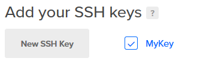


## Getting Started: Create Your Droplet

At this point all that needs to be done is choosing a hostname and then clicking the Create button.  You don't need to rename your droplet and, for this readme tutorial, I will keep the default hostname.

A few things to take note of:

*  I chose to use a One-Click-App configuration.  If you want more control over your configuration, you can create a droplet with just a Linux distribution installed then connect to your droplet and install whatever you need for your projects.

*  Choosing One-Click-Install offers other stacks (MEAN, Django, etc)

After your Droplet has been created, your Droplets page should look like this:
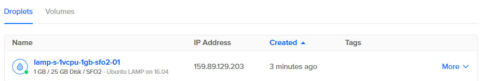

## Connect To Your VPS

When you created your Droplet, an associated [IP Address](https://www.youtube.com/watch?v=k6nrH8JiTTU) was also created to identify it on the Internet.  In my example the IP Address is ```159.89.129.203```.  Your IP Address will be listed next to your Droplet name on your Droplet menu on DigitalOcean (See the image above for an example)

This IP Address can be entered into your web browser and you will be taken to your site hosted on your VPS.  The default page generated should look like this:

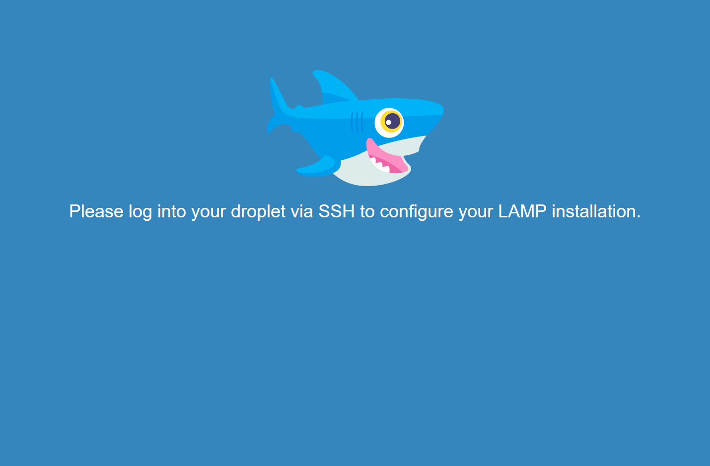

This is the default page generated from when you set-up your Droplet with the LAMP stack.  This file can be edited in the same way that a local file that exist on your computer can be edited.  To edit it, however, you need to connect to your server via Git Bash (Or whatever Terminal application you use on your computer) to access the HTML file.  Here is where setting up your SSH key in the previous section will be of use:

1.  Open Git Bash and enter the following: ```ssh root@your.ip.address.here```

    Because you set up an SSH Key pair, your private key will be used to identify you through the use of the public key that exist on your VPS.  No login password is required.

2.  Once you have confirmed that you can login via SSH, you may want to disable the login via password option.  The steps for doing so can be found at [Step Six](https://www.digitalocean.com/community/tutorials/how-to-use-ssh-keys-with-digitalocean-droplets#step-six%E2%80%94lockdown-root-ssh-access-to-keys-only) from the DigitalOcean guide I linked to earlier

Now that you are logged into your server, it is no different than being in a directory locally.  Using the ```pwd`` command, you can see that by default you are at the /root location.  The HTML file that displays the content on your website is located at **/var/www/html** and although you could navigate to this location and edit the HTML file with Vim, there is another option to make this process easier.

## Connect via SFTP and WinSCP

Through the use of the Secure File Transfer Protocol (SFTP), files can be uploaded to your server using the same SSH process you use to connect to your server from the Terminal.

*For more information about File Transfer Protocols, see the resources at the top of this readme* 

There are several applications available that offer a GUI interface for connecting and administering files on your server, but for those that prefer using the command line, you can use the following guide from DigitalOcean: [How To Use SFTP to Securely Transfer Files with a Remote Server ](https://www.digitalocean.com/community/tutorials/how-to-use-sftp-to-securely-transfer-files-with-a-remote-server)

Since I am on a Windows machine I will be using [WinSCP](https://winscp.net/eng/download.php).  Another popular SFTP client for Mac and Windows is [FileZilla](https://filezilla-project.org/)

1.  After downloading and installing WinSCP, open the file.  A prompt should open up asking for you to login.  Enter the following credentials to get started:

    *  For **Host name** enter the IP Address of your Droplet/VPS
    *  Keep the port number at its default (22)
    *  Enter *root* for the **User name**

2.  You won't be entering a password because you connect to your server through SSH.  Click the advanced tab from the login menu then, from the sidebar, look for **SSH** and then **Authentication**

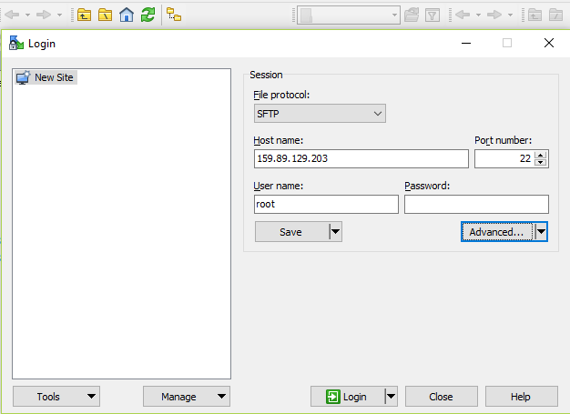

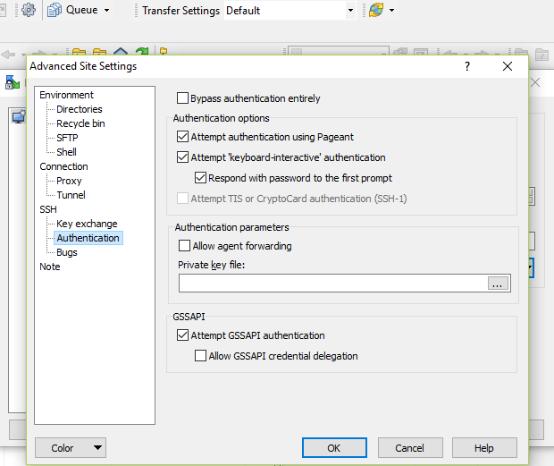

3.  Under the **Private key file** field click the 3 dots to browse your local directory and navigate to where your SSH keys are stored.

    **NOTE** If your private key is not stored in *.ppk* format, nothing will appear in your directory because only .ppk files are allowed to be used.  However, you can convert your private key to .ppk format by first showing all files:

    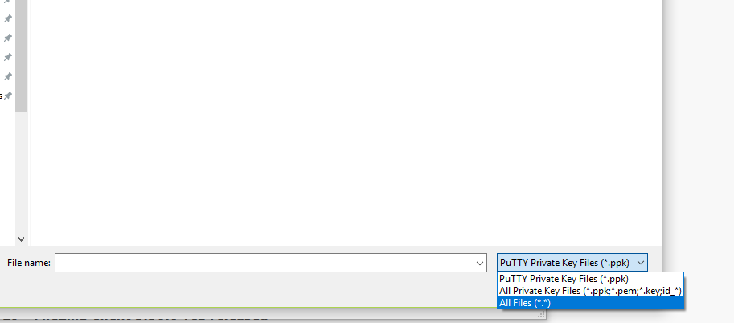

    Then, upload your private key file (the id_rsa file that doesn't have a file association).  When doing so, a prompt will come up asking if you want to convert your private key into .ppk format.  Click yes and, after your file is converted, it will be inserted into the **Private key file** field.

4.  After your credentials and private key have been entered, click the **login** button.

You are now connected to your server via SFTP.

---

As when connecting to your VPS using SSH, you start off at the root directory.  This is shown on the right side window of the WinSCP application.  There is nothing in the root directory, so no files should be displayed.  Let's edit the default HTML page before uploading our own files:

1.  Double click the folder in the root directory to be taken to the parent directory and navigate to /var/www/html

2.  The default files created when creating your Droplet are displayed here.  A best practice for security reasons is to remove the **info.php** file.  Delete the file.

3.  By right clicking the index.html file and hovering over the *Edit* option, you can configure which editor you want to use to open the file.  If you prefer, you can open it with the internal (default) editor.  Here you will see the contents that make up the default page you saw earlier when you entered the IP address of your web site.

4.  You can delete this file or upload your own here.

I am going to delete the default HTML file so I have an empty directory to work with when uploading my PHP site.

## Change Default File Location

*This section covers something I found useful the first time I deployed my application: [What is the correct folder to put my website files](https://www.digitalocean.com/community/questions/what-is-the-correct-folder-to-put-my-website-files-var-www-or-var-www-html)*

By default, HTML and PHP files are placed in the ```/var/www/html``` directory but this can be changed by editing the *000-default.conf* file located at ```/etc/apache2/sites-enabled/```.  You may want to do this to host multiple sites, which would require a different file structure (When I learn how to do this, I will update this readme with how to host multiple sties on one Droplet).

To change the default file location, open the *000-default.conf* file and, where it says ```DocumentRoot /var/www/html``` change it to the name of your application (or anything you'd like):

```
DocumentRoot /var/www/myapp
```

**Keep in mind that this will be the folder you make to replace the html folder that was deleted in the previous section**

Save the file, exit the application.  It's recommended to restart the server after making these changes.  You can do so by logging into your server from your Terminal then entering the following command:

```
service apache2 restart
```

## Uploading the PHP Site

1.  Navigate to ```/var/www/``` and create the directory you associated with DocumentRoot from the previous section.  My file is called *phpnote* so the directory my files will go in will be at ```/var/www/phpnote```

2.  From your local directory, navigate to the location of your application files that you want to upload.  Copy the contents within your application folder and paste them into the empty directory located on your server.

    *You could also copy and paste the entire application folder, but you'll have to go back a directory, paste the folder and rename it to whatever you changed the DocumentRoot to*

3.  If your index.php page doesn't rely on any MySQL queries or other dependencies, you should be able to go to your web page and see your changes.

4.  If you want to edit/delete a file, you can do so from the WinSCP client or you can make changes locally, delete old files from your server directory then upload your changed files again.

## Setup MySQL

When you installed the LAMP stack when first initializing your Droplet, you installed MySQL but it still needs to be configured on your server.

The Message of the Day displays the following message when logging into your server through SSH:
```
You are encouraged to run 'mysql_secure_installation' to ready your server for
production.
```

And this is what you should do before doing anything with MySQL on your server, but first you need the password before you can run the command.

To get the default MySQL password use the following command:
```
cat /root/.digitalocean_password
```

Something like ```root_mysql_pass="5e6518ad1fffafafj23j43434234112jjfdsa"``` should display.  Copy the password then run the ```mysql_secure_installation``` command and paste the copied password at the prompt (without the quotes).

If you entered the correct password several prompts will appear:

1.  Would you like to setup VALIDATE PASSWORD plugin?

    This is up to you.  For a demo application with no real security implications, a LOW setting is fine but for a full-fledged production application, always use the strongest password option.

2.  Change the password for root?

    If you don't want to use the default MySQL password, here is where you would change it to a password of your choice

3.  Remove anonymous users?

    This should always be yes unless for testing reasons you need an anonymous user

4. Disallow root login remotely?

    For this demo application, I will NOT disallow root.  For a production application root should be removed and user privileges should be set instead.

5. Remove test database and access to it?

    This is for testing purposes and should be removed

6. Reload privilege tables now?

    Yes.  This will, as the prompt description says "ensure that all changes
made so far will take effect immediately."

MySQL is now setup and ready to be used with your PHP project.  You can test that mysql is working, along with your password, by entering ```mysql -p``` and your password.

## Connect to MySQL using an SSH Client

Now that MySQL is set up on your VPS, you can use it with your project.  If you're like me and developed locally using something like XAMPP or MAMP, you may be used to using something like phpMyAdmin for working with your MySQL databases.  For this section I will be using [HeidiSQL](https://www.heidisql.com/).  If you're on Mac [Sequel Pro](https://www.sequelpro.com/) is a popular option with a similar set-up process for connecting through SSH.

*If you want to use phpMyAdmin, check out this [tutorial](https://www.youtube.com/watch?v=4GjC2Qc82U0&index=6&list=PLfdtiltiRHWFuRwcp93nixCyT7zhHWUi1).  It should point you in the right direction.  When I learn how to set it up, I will update this readme on how to use it*

After downloading, installing and opening HeidiSQL, you'll be asked to enter your MySQL information.  By default, **Network type** is set to *MySQL TCP/IP*.  Again, we're using SSH to connect to our VPS, so change this to *MySQL (SSH Tunnel)*

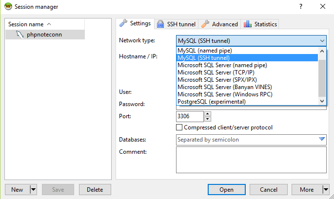

Then continue to enter the following information from your MySQL configuration you setup in the previous section:

* **Hostname**: localhost
* **User**: root
* **Password**: *YOUR_MYSQL_PASSWORD*

The **Port** number will remain the same (3306) and **Databases** can remain empty.

Setting up the SSH tunnel is similar to how you did it in previous sections, but HeidiSQL requires a **plink.exe** file, which you can get when downloading [PuTTY](https://www.chiark.greenend.org.uk/~sgtatham/putty/)

*See this [stack overflow post](https://stackoverflow.com/questions/10940733/putty-vs-winscp) for more information about the difference between PuTTY and WinSCP*

After downloading PuTTY, navigate to the **plink.exe** file within your PuTTY folder and enter its location as the *plink.exe location*

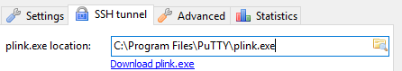

Then enter the following information:

* **SSH host + port**: *YOUR_DROPLET_IP* (keep port at 0)
* **Username**: root

For your **Private key file** use the same *id_rsa.ppk* file you used when connecting via SSH in the [Connect via SFTP and WinSCP](#connect-via-sftp-and-winscp) section.

**Localport** will remain at its default, 3307

Here is a summary of what the **Settings** and **SSH Tunnel** configurations look like for my project:

**Settings**        
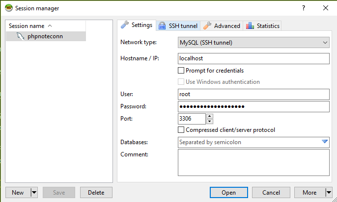

**SSH Tunnel**        
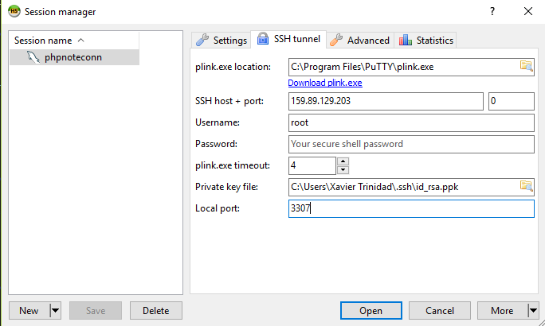

You should now be able to click open and connect to your MySQL Database on your VPS.

## Export local MySQL Database and Import to Your VPS

If you're using XAMPP/MAMP for local development, the following steps will show you how to export your project's database and import it into your VPS using HeidiSQL:

1.  Open XAMPP/MAMP and start the Apache and MySQL servers.

2.  Open your web browser and navigate to **localhost** then click on phpMyAdmin

3.  Ensure you're at the home page (<http://localhost/phpmyadmin/>) then at the top nav bar click on **Export**

    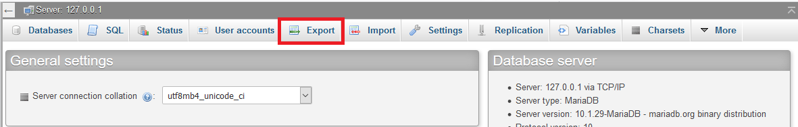

4.  You don't want to export all of your databases, just the one for your project so we'll have to do a custom export.  **Quick** export is seleted by default, choose **Custom** to display more options.

5.  By default, all databases are selected for export in the **Databases** option. Select only the database you are using with your project.

    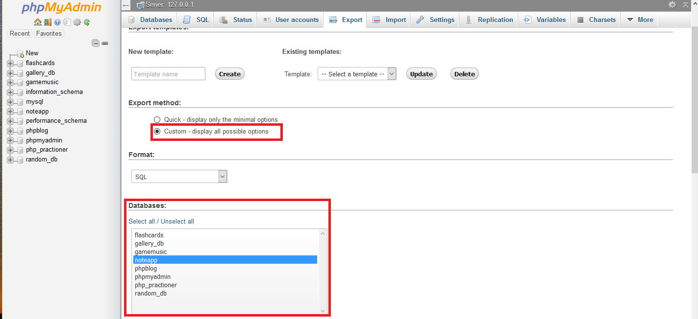

6.  All other configurations can stay at their defaults.  Scroll down to the bottom and click **Go** and save the SQL file to your preferred location.

7.  Open HeidiSQL (or whatever client you're using) and connect to your VPS

8.  Once you're connect, go to File > **Run SQL File...** and open the file you exported from phpMyAdmin

9.  Press **F5** or click the **Refresh** button to refresh the database.  Your project's database should now be imported.

Now that your database is on your VPS, some configuration needs to be done to your PHP database file to get it to work the same way it did locally.

## Configure Your PHP Database File

Assuming that your PHP application was fully functional locally, it should work the same once you upload it to your VPS.  The only thing that needs to be changed is the database settings within your PHP code.  Locally, you used different credentials to establish a connection to your local server.  When you created your Droplet/VPS, you set up different credentials for accessing your MySQL database.

Below is an example of what my local database configuration looks like:

```php
$dbServername = "localhost";
$dbUsername = "root";
$dbPassword = "*************"; // password hidden
$dbName = "noteapp";

$mysqli = new mysqli($dbServername, $dbUsername, $dbPassword, $dbName);
```

*My project is using mysqli.  Your project might be using PDO so the configuration will be different.*

The two things that need to be changed is the database password and, if you named your database something different after importing it, the database name.  The following steps will perform this for you:

1.  Open WinSCP (or whatever file transfer client you're using) and connect to your VPS

2.  Navigate to /var/www/YOUR_APPLICATION; the file location where you uploaded your files in the [Uploading The PHP Site](#uploading-the-php-site) section.

3.  Locate the file where you make your database connection, right click it and choose **Edit**

4.  Replace your database password with the password you created when configuring MySQL on your VPS

5.  Change the database name if you renamed your database something different after it was imported

6.  Save the changes then go to your site and ensure your database is working


## Deployment Conclusion

At this point, your PHP application should be fully configured.  All files should be uploaded and the database should be connected.  Everything should be working the same way it worked locally.  If this is a demo application to show to others, you can ignore the next sections.

If you want to learn how to add a domain name and configure it on DigitalOcean, continue on with this readme


---


 

