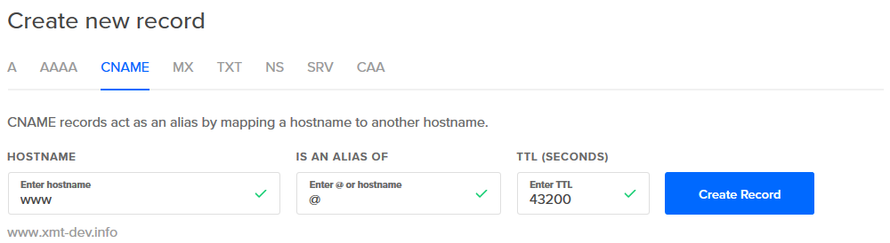

# Set Up a Host Name

If you deployed your site and now want to configure your DigitalOcean droplet to use a host name, this readme file will outline the basic steps get this done.  For a more comprehensive tutorial see the official documentation: [How To Set Up a Host Name with DigitalOcean](https://www.digitalocean.com/community/tutorials/how-to-set-up-a-host-name-with-digitalocean)

**Table of Contents**       
[Helpful Concepts](#helpful-concepts)      
[Purchase a Domain Name](#purchase-a-domain-name)      
[Add Domain to DigitalOcean](#add-domain-to-digitalocean)      

##  Helpful Overview

Before moving on, I would recommend watching the following videos to get an overview of DNS, Domain Registrars and other related concepts:

 |      Topic       |   Link    |
 | ---------------- | --------- |
 | An Overview of DNS | [Professor Messer](https://www.youtube.com/watch?v=At_wGn1jA1E)
 | DNS Records | [Professor Messer](https://www.youtube.com/watch?v=7ufXpe14IEE)
 | What is a Domain Registrar? | [Domain Registration Reviews](https://www.youtube.com/watch?v=DbrHbKOZ5i4)
 | What Happens When You Click a Link? | [Computerphile](https://www.youtube.com/watch?v=keo0dglCj7I)

 ## Purchase a Domain Name

 There are many Domain Registrars available.  I will be using [namecheap](https://www.namecheap.com/) for this tutorial.

 Before registering for an account you can search for your desired domain name.  I will be registering a name to use in my personal portfolio page (that I will create in the future), which will be ```xmt-dev.info```.  
 
 You can choose any Top Level Domain (TLD) available and that you're willing to pay for.  For demo applications, you can click the **Discounted** tab for the cheapest options available.  Namecheap does not auto renew so you can make a one-time purchase of a domain name and forget about it if you never use it again.

 Once you have chosen a domain name, add it to your account then click on View Orders to checkout.  Ensure that Whoisguard is included (it's should be included by default).

 

 Confirm your order and checkout using your payment option

 ## Connect your Domain Name to your VPS

 *For a more comprehensive guide of what this section covers, see the official DigitalOcean documentation: [How to Point to DigitalOcean Nameservers From Common Domain Registrars](https://www.digitalocean.com/community/tutorials/how-to-point-to-digitalocean-nameservers-from-common-domain-registrars#registrar-namecheap)*

 You can view your newly purchased Domain Name and manage it from the **Dashboard** on namecheap.  At your Dashboard page you should see your domain name listed:

  

To connect your domain name with your DigitalOcean Droplet/VPS, you'll first have to configure the default **nameservers** to use DigitalOcean's nameservers instead.  This can be done by doing the following:

1.  At your Namecheap Dashboard, go to where your domain name is listed and, at the end of the row, click the **Manage** button.

2.  You should now be at the *Domain List* page.  Locate the **Nameservers** section.  The default *Namecheap BasicDNS* option is chosen.  Click the dropdown menu and choose **Custom DNS**.

    

3.  Add the following nameservers into the nameserver fields:

    * ns1.digitalocean.com 

    * ns2.digitalocean.com

    * ns3.digitalocean.com

5.  Click the green check mark to confirm the changes

Once these nameservers are changed it may take some time for the changes to be applied, but you can still move onto the next section that will add a domain to your Droplet.

## Add Domain to DigitalOcean

Back on DigitalOcean log into your account to view your Droplets and click on the one you want to configure with your new domain name.

Click the **Networking** tab at the top.  If your Droplet hasn't been configured with a Domain, you should see a screen that looks like this:


Enter the domain name that you purchased and click **Add Domain**.  Once your domain name is found, the following screen will display:


The two parts surrounded by the purple box in the image can be ignored for now.  If you followed the tutorial up to this point, you already updated your domain name servers to point to the DNS records, listed at the bottom.

To make it so when you enter your domain name into a web browser you are taken to your website, you need to create an **A** record.  You will also need to create a **CNAME** record so that when you type *www* at the beginning of your domain, it will redirect to your website.  *See the first section about DNS Records for more information about record types*

To create an **A** record:

1.  Click the **Hostname** input field and type the ```@``` symbol.  This will automatically insert your domain name as the hostname

2.  Click the **Will Direct To* field and choose your Droplet

3.  The **TTL** can stay at its default.

4.  Click the **Create Record** button

Here's an example of an A record from my configuration:


To create a **CNAME** record:

1.  Click the CNAME tab then at **Hostname** type in ```www```

2.  Click the **Is an alias of** tab and enter the ```@``` symbol

3.  The **TTL** field can remain at its default

4.  Click the **Create Record** button

Here's an example of an CNAME record from my configuration:



Once these records have been created, your DNS records table on DigitalOcean should look something like this:


---

With your Domain and DNS Records set, you can now visit your website by typing in your domain name in your web browser.  If you don't see your website, it could be that the changes to the nameservers haven't propagated yet.  It could take up to 24 hours for the changes to take effect.


